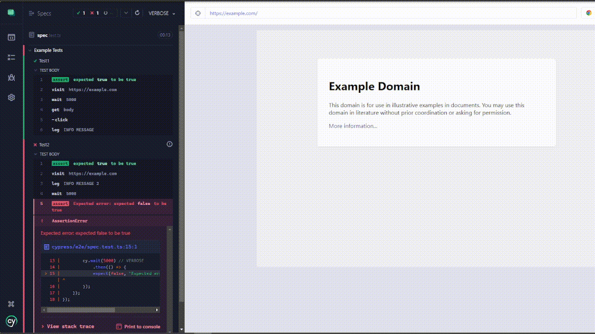

## Cypress Log Filter Plugin
[](https://github.com/Brugui7/cypress-log-filter/actions/workflows/npm-publish.yml)


The Cypress Log Filter Plugin is a plugin for Cypress that allows you to filter logs based on different log levels. This plugin provides a convenient way to control the log output during your Cypress test runs.

### Cypress Log Filtering Limitations

By default, Cypress does not provide built-in log filtering capabilities. It only allows you to hide all logs entirely, which would also hide any errors. This limitation can make it challenging to focus on specific log levels or troubleshoot issues effectively.

To mitigate this limitation, the Cypress Log Filter Plugin enhances Cypress with the ability to filter logs based on different log levels, providing more flexibility and control over the log output during your tests and reducing the memory consumption when a test executes lot of commands.

If you prefer to disable the command log completely, refer to the official Cypress documentation on [Disabling the Command Log](https://docs.cypress.io/guides/references/troubleshooting#Disable-the-Command-Log).


### Installation

To install this plugin, you can use either npm or yarn:

```bash
npm install cypress-log-filter-plugin --save-dev
```

or

```bash
yarn add cypress-log-filter-plugin --dev
```

Then, import the plugin in your `support/e2e.js` file

```javascript
require("cypress-log-filter");
```

### Configuration

#### Setting the Log Level in `cypress.config.ts`

You can configure the log level by adding a `logLevel` property to your `cypress.config.ts` configuration file:

```
e2e: {
  env: {
    logLevel: "VERBOSE"
    ...
  }
  ...
},
```

The available log levels are:

- **VERBOSE** (Default): Shows all logs, including verbose, info, assert, and error.
- **INFO**: Shows `cy.logs` messages, assert, and error logs.
- **ASSERT**: Shows assert and error logs.
- **ERROR**: Shows only error logs.

#### Setting the Log Level via Environment Variable

Alternatively, you can set the log level as an environment variable named `CYPRESS_LOG_LEVEL`. When Cypress runs, it will read this environment variable and apply the specified log level.

```bash
CYPRESS_LOG_LEVEL=INFO npx cypress run
```

### Usage

Once the plugin is installed and the log level is configured, the log output will be filtered accordingly. Only logs with the specified log level and higher will be displayed in the Cypress test runner.

For example, if the log level is set to **INFO**, all logs of level **INFO**, **ASSERT**, and **ERROR** will be shown. **VERBOSE** level logs will be hidden.

#### Modifying Log Level in Cypress Test Runner

When running Cypress with `npx cypress open`, the Cypress Log Filter Plugin adds a dropdown menu to the interface. This dropdown menu allows you to modify the log level on the fly while interacting with your tests.



### Contributing

Contributions are more than welcome! If you find any issues or have suggestions for improvements, please open an issue or directly submit a pull request and I'll try to review it ASAP.


---

Thank you for using my first Cypress plugin. If you have any questions or need further assistance, please feel free to reach out.

